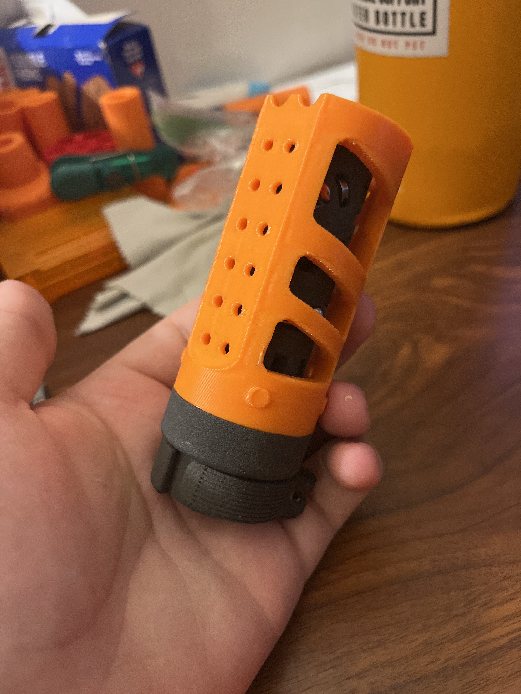
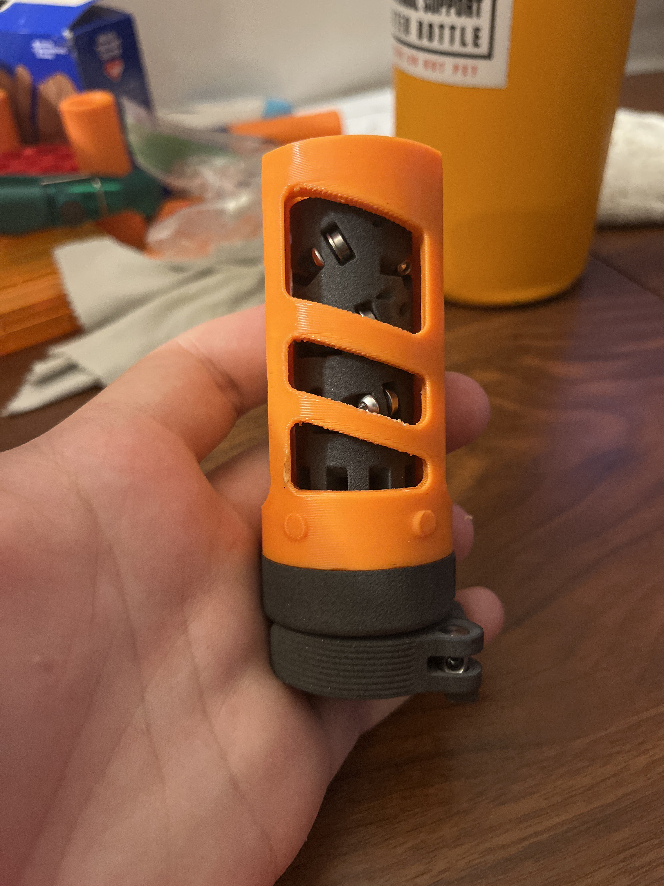
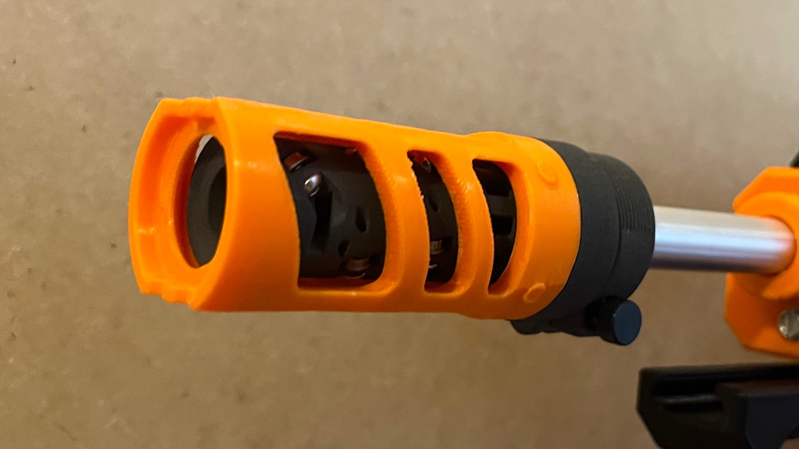

# OldStyle Andromeda BCAR Shroud (Gen4)

  

Meant to fit the Gen4 Andromeda BCAR by EliWu, available here from Roboman: https://roboman.net/products/andromeda-bcar-kit

This print needs tree supports and a brim. Recommended to print at 100% infill 5 walls.

This shroud is modeled off of the original Andromeda Gen1 shroud, reverse engineered via screenshots of old youtube videos from EliWu. He says its quite close to the original!

**If you wish to print and sell this item, please contact me for licensing. I can be reached on Discord (Sillybutts#5905) or Reddit (u/SillyTheGamer). We will also need to discuss with Eli Wu.**

 This work is licensed under a <a rel="license" href="http://creativecommons.org/licenses/by-nc-sa/4.0/">Creative Commons Attribution-NonCommercial-ShareAlike 4.0 International License</a>.

## If you like what I do, please consider supporting me!

**I don't charge for my files, so any donations or merch purchases would be greatly appreciated!**

https://www.redbubble.com/people/Sillybutts/shop RedBubble full of fun Nerf-y sticker and merch designs!  

https://www.patreon.com/sillybutts 

https://www.buymeacoffee.com/sillybutts 

## Images

